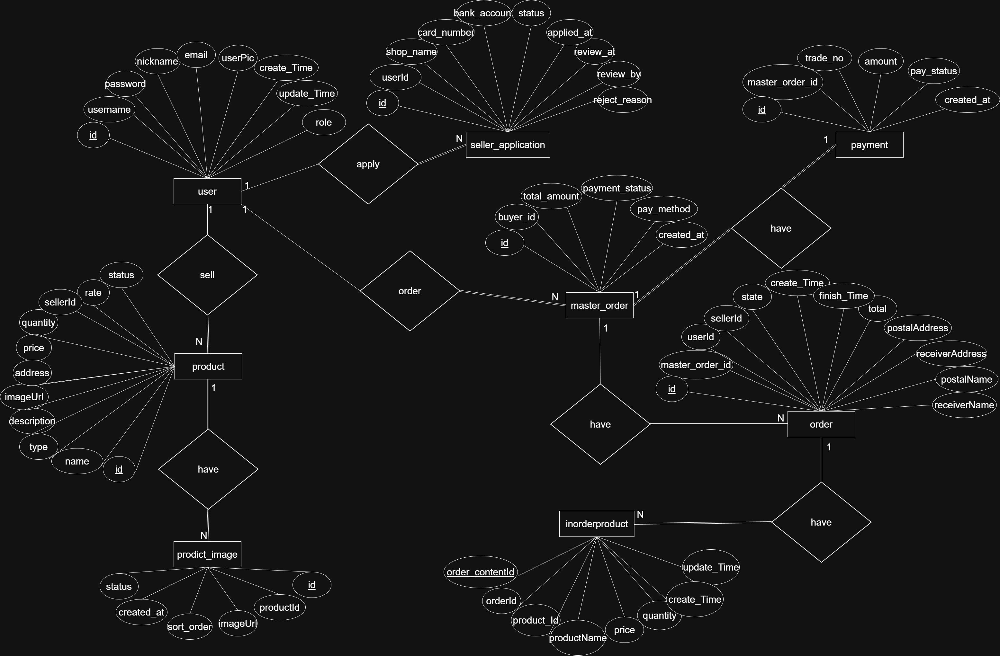

# 基於Spingboot 框架搭建的電商平台
這是一個以 Spring Boot + Vue3 建構的全端電商平台，
支援商品管理、Redis 購物車快取、訂單建立、藍新金流付款、AWS S3 圖片儲存、
採用 JWT 角色權限控管等完整功能。，支援買家與賣家功能。

## WEB API
| api           | spec        |
|---------------|-------------|
| BuyerShopping | 商品瀏覽頁       |
| BuyerOrder    | 商品訂單管理      |
| Cart          | 購物車         |
| Image         | 圖片          |
| Payment       | 支付與金流       |
| sellerOrder   | 賣家訂單管理      |
| sellerProduct | 賣家商品管理      |
| user          | 帳號登入、註冊角色申請 |

## 功能列表（Features）
### ✔ 買家（Buyer）

* 使用者註冊 / 登入（JWT)  
* 商品瀏覽、分類、搜尋 
* 使用 Redis 儲存購物車（快速 + 不占 DB） 
* 下訂單、付款流程（NewebPay 金流） 
* 訂單查詢、付款狀態更新 

### ✔ 賣家（Seller）

* 商品新增 / 修改 / 上架 / 刪除 管理 
* 訂單進度管理

#### ✔ 後台（Admin）
* 權限管理（僅管理員可操作）

 

### ✔ 系統層級（System Level）

Redis 快取：購物車、Session、熱門商品
Spring Security + JWT：角色權限（BUYER / SELLER / ADMIN）
藍新金流（NewebPay）整合：含 Callback / NotifyURL

## 技術架構
Spring Boot、Spring Security + JWT、mybatis、Redis、Mysql、Maven、

## ER MODEL

## 系統架構圖
